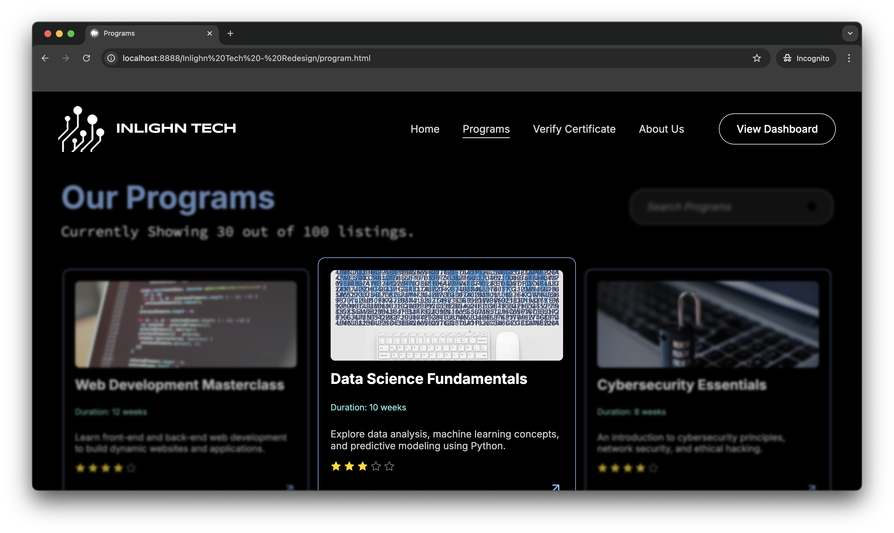

# frontend-design
This was a redesign of a website "Inlighn Tech" under a front-end challenge organised by IIT Bhubaneshvar.

# Inlighn Tech — Internship & Course Platform

🚀 My challenge was to redesign this website and here I am.
A responsive, modern website built to showcase internships, training programs, and learning opportunities in cybersecurity, AI, and full-stack development.

## 🌐 Live Demo
[🔗 View Website](https://Prajwal115.github.io/frontend-design)

---
---

## ✨ Features

- 🔥 Typewriter Hero Animation
- 🎯 3D Model Integration (using `<model-viewer>`)
- 📱 Fully Responsive Layout
- 📊 Stats Section with Flexbox
- 🎡 Slider Section for Features
- ⚡ Loader with Progress Bar
- 🌗 Minimal Dark UI

---

## 📦 Technologies Used

- HTML5 & CSS3 (Flexbox, Grid)
- JavaScript (Vanilla)
- Google Fonts – Inter, Source Code Pro
- [Google `<model-viewer>`](https://modelviewer.dev/) for 3D Models
- Icons: [Material Icons](https://fonts.google.com/icons)

---

## 📸 Screenshots

| Landing Section | Courses Section |
|-----------------|-----------------|
|  |  |

---
